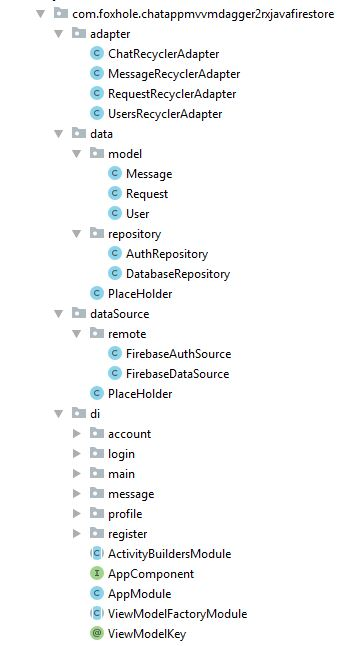
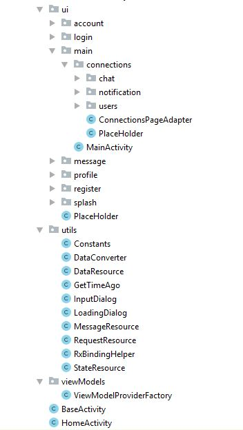

# ChatApp-MVVM-Dagger2-RxJava-Firestore

This is a android app practice project. I have created a Chat App. I combined this project with RxJava+Dagger2+MVVM+Firestore.
In google-services.json use
"api_key":
{
        "current_key": "Enter Your api key"
}

## App features
-Sign in  
-Sign up  
-Profile Image and status update  
-Send friend request  
-Accept friend request  
-Decline friend request  
-Unfriend  
-Chat with friend  
-Notification list  
-Chat list  
-User list  
-View user profile  

## Used Component
-MVVM  
-FirestoreUI 
-Firestore  
-AndroidX  
-ViewModel and LiveData  
-RXJava2  
-Dagger 2  
-Used language Java

## App overview 

## Project Structure 

